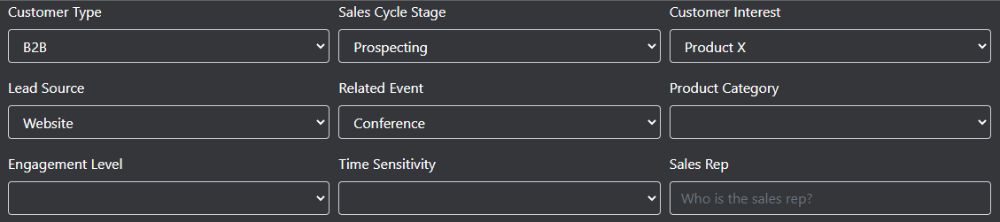
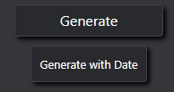
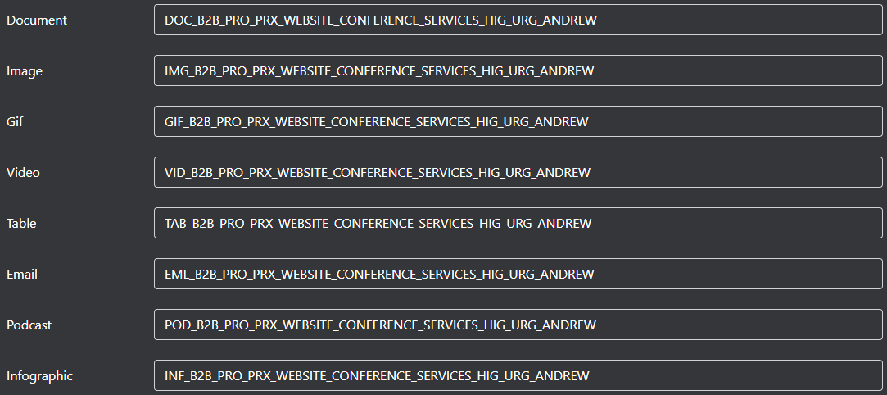

# FilePattern

FilePattern is a program to concatenate various "tags" involving files from any company, so that they can be easily found later. This is achieved by standardizing all the company's files with multiple tags, which can be used to find them later.

**WARNING:** The labels and values of all inputs are just examples and do not represent a real and meaningful standardization. It is up to the user of the code to change them to a standardization that represents something real in the future.

## HTML and CSS

The HTML of the file is composed of a form that contains three main parts: inputs, buttons, and outputs.

### Inputs

The inputs can be of five types:

- Dropdown only: This input has only fixed responses and cannot be customized.
- Dropdown with an option to write a custom input: This input has fixed responses, but its last option, when selected, opens a text input to receive a custom response. 

- Optional dropdown with an option to write a custom input: This input performs the same actions, but its concatenation is not mandatory, so it starts with an empty field.

- Optional dropdown only: This input has only fixed responses but also does not have mandatory concatenation.
- Custom free-form input: This input is text-based and not mandatory.

### Buttons

Next, there are two buttons to concatenate the inputs:

- The first button is the main one that will concatenate all the chosen options from the inputs.
- The second button is an option to concatenate with the current date on which the file is named with a standardized name.

### Outputs

The outputs will show the result of the concatenation with a prefix of the eight types of files that should be standardized in this company. It is up to the user to copy the generated text of the file type it contains and standardize it with that text now.

## JavaScript

The code that processes the program is inserted in the "FilePattern" class, which only needs a reference form to be started with the init() method.

First, it will initiate classes that handle custom inputs and generate a warning box for these inputs. Then, it will add the submit event to the form, which will handle the concatenation of tags for the output.

Before presenting the concatenation to the user, the result is passed to other methods to perform checks that analyze whether the name contains more than 100 characters and whether the mandatory inputs are empty.
